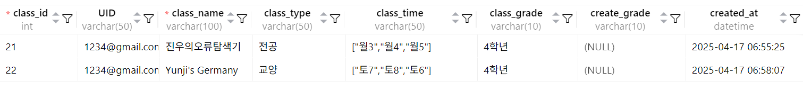

# ⚙️ 기능 기술서

github 링크 : [https://github.com/kankinku/project](https://github.com/kankinku/project)  
서버 접속링크 : [http://192.168.0.44:8000/](http://192.168.0.44:8000/)

## ✔️ 기술 속성 정의

---

학점 계산 시스템은 학생의 과목 별 성적 데이터를 바탕으로 학점을 계산하고, 시간표 기반 조회 기능을 제공하는 웹 애플리케이션이다. 학생 로그인 후 성적 입력 및 조회가 가능하며, 시간표 기반 학습 이력 확인 기능이 포함된다.

## ✔️ 데이터 베이스 정의

| 항목 | `user_info` | `class_info` |
|------|-------------|--------------|
| **구조** | `user_info` --------------- `UID` (Primary Key) `passwd` `name` | `class_info` --------------- `UID` `class_name` `class_type` `class_time` `class_grade` `create_grade` |
| **코드** | <pre>CREATE TABLE user_info (
  UID VARCHAR(50) PRIMARY KEY,
  passwd VARCHAR(255) NOT NULL,
  name VARCHAR(100) NOT NULL,
  created_at DATETIME DEFAULT CURRENT_TIMESTAMP,
  updated_at DATETIME DEFAULT CURRENT_TIMESTAMP ON UPDATE CURRENT_TIMESTAMP
);</pre> | <pre>CREATE TABLE class_info (
  class_id INT AUTO_INCREMENT PRIMARY KEY,
  UID VARCHAR(50),
  class_name VARCHAR(100) NOT NULL,
  class_type VARCHAR(50),
  class_time VARCHAR(50),
  class_grade VARCHAR(10),
  create_grade VARCHAR(10),
  created_at DATETIME DEFAULT CURRENT_TIMESTAMP,
  FOREIGN KEY (UID) REFERENCES user_info(UID)
);</pre> |

---

## CRUD

✅ **C(Create)**

| 구분 | 내용 | 관련 레이블 |
| --- | --- | --- |
| **학생 정보 등록** | 학번(UID), 이름, 비밀번호 등 입력 → `user_info` 저장 | `user_info` |
| **수강 정보 등록** | 과목명, 수업 유형, 수업 시간 입력 → 수강 정보 생성 및 연결 | `class_ info`, `user_class`  |

✅ **R(Read)**

| 구분 | 내용 | 관련 레이블 |
| --- | --- | --- |
| **학점 조회** | 학생 UID를 기준으로 과목명, 성적, 평균 GPA 등을 조회 | `class_info`, `user_class` |
| **시간표 조회** | 과목 시간을 기준으로 주간 단위 시간표로 과목 조회 | `class_info` |

✅ **U(Update)**

| 구분 | 내용 | 관련 레이블 |
| --- | --- | --- |
| **성적 입력/ 수정** | 과목별 성적(class_grade), 환산 학점(create_grade) 등을 입력 수정 | `class_info` |
| **수강 정보 수정** | 과목명, 수업 시간, 수업 유형 등 수강 관련 정보 수정 | `class_info` |

✅ **D(Delete)**

| 구분 | 내용 | 관련 레이블 |
| --- | --- | --- |
| 수강 과목 삭제 | 지정된 class_id의 과목 정보를 삭제, 수강 정보 연동 해제 | `user_class`, `class_info` |
| 학생 계정 삭제 | UID 기준 학생 정보를 삭제할 경우, 연관된 수강 및 성적 정보도 함께 삭제 | `user_info`, `user_class`, `class_info` |

## ✔️ 개발 Tool

| 항목 | S/W |
| --- | --- |
| 개발 언어 | Python, HTML/CSS |
| DBMS | MySQL |
| IDE | VSCode, MySQL Workbench |
| Framework | Django |

# 기능 구성 정의

## C(Create)

### 1. 회원가입 - 가입자 정보 생성

- 기본 기능  
    - 로그인 화면에서 계정이 없을 경우 **Register**를 눌렀을 때 회원가입 화면으로 이동한다.  
    - 회원가입 화면에서 **이름(Name), 이메일(Email), Password(비밀번호), User 항목**을 입력 받는다.  
    - 회원가입 입력 조건 처리  
        - Name은 문자열 입력  
        - Password는 보안을 위해 `type="password"`로 설정  
        - User는 **드롭다운 목록**을 통해 선택  
        - 모든 입력값이 유효한 경우 **Register 버튼 활성화**  
        - 이메일 형식 오류 시 경고 메시지 표시  
        
        

    - 로그인 완료 후 화면  
        - dashboard 좌측 상단에 **User Name** 출력  
        
        

    - 회원가입 완료 시 DB에 사용자 정보 저장  
      
      

### 2. 시간표 생성

- Create Class 기능  
    - 대쉬보드 우측 상단 헤더의 Create 버튼 클릭  

      

    - 클래스 생성 화면  
        - **클래스명, 클래스 유형, 학년** 입력  
        - 클래스 유형/학년은 드롭다운 선택  

          

    - Select schedule 버튼 클릭 시 시간표 선택 UI 표시  

      

    - Submit 버튼 클릭 → DB에 저장  

      

## R(Read)

### 시간표 읽어오기

- 대시보드에서 시간표 확인  

  

- Delete 창에서 과목 정보 및 성적 확인  

  

## U(Update)

### 학점 계산 기능

- 학점 평균 계산  
    - 성적은 드롭다운으로 입력  

      

    - 전체 평균 / 전공 평균 출력  

      

    - 성적 입력 후 DB에 업데이트  

      

## D(Delete)

### 과목 삭제 기능

- 삭제 과목 체크박스로 선택  

    
  

- DB에서 삭제 확인  

  

## 부가 기능

### 1. 대시보드에서 현재 시간 확인 및 과목 체크 기능

### 2. 성적 피드백 조건 (3.0 이하, 4.0 이상)

## ✔️ 기능 데이터 흐름

1. 회원가입 → 2. 로그인 → 3. 시간표 등록 → 4. 성적 입력  
5. 학점 계산 → 6. 시간표 조회

## ✔️ 데이터 유효성 검사

| 항목 | 유효성 조건 | 오류 처리 방식 |
| --- | --- | --- |
| 학번(UID) | 영문+숫자 혼합, 최대 50자 | 중복 시 오류 메시지 |
| 비밀번호 | 8자 이상, 특수문자 포함 | 형식 불일치 시 비활성화 |
| 과목명 | 문자열, 100자 이내 | 미입력 시 저장 불가 |
| 수업 시간 | 요일+숫자 배열 (예: "월1", "화3") | 형식 불일치 시 저장 불가 |
| 학년 | 드롭다운 선택: 1~4학년 | 미입력/형식 오류 시 저장 불가 |
| 성적 | 드롭다운 선택: 'A+' ~ 'F' |  |